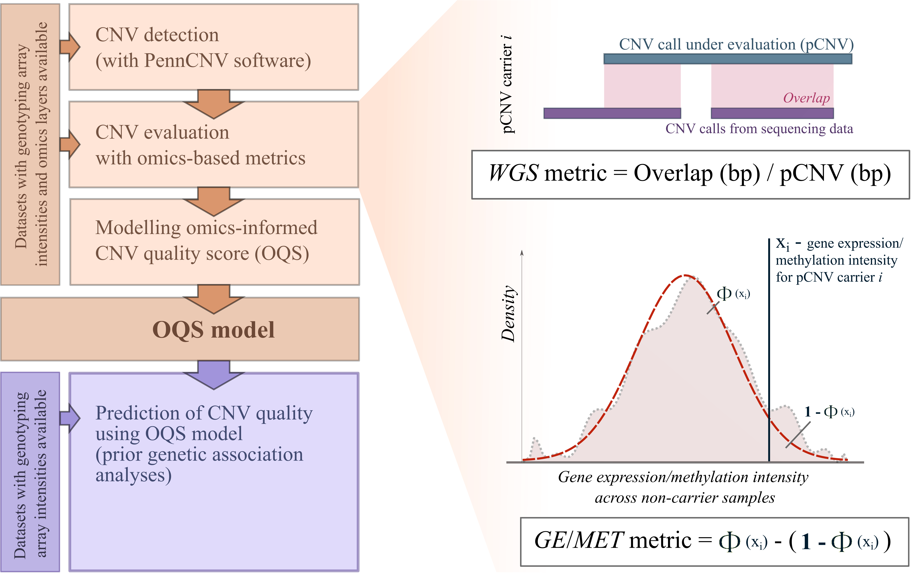
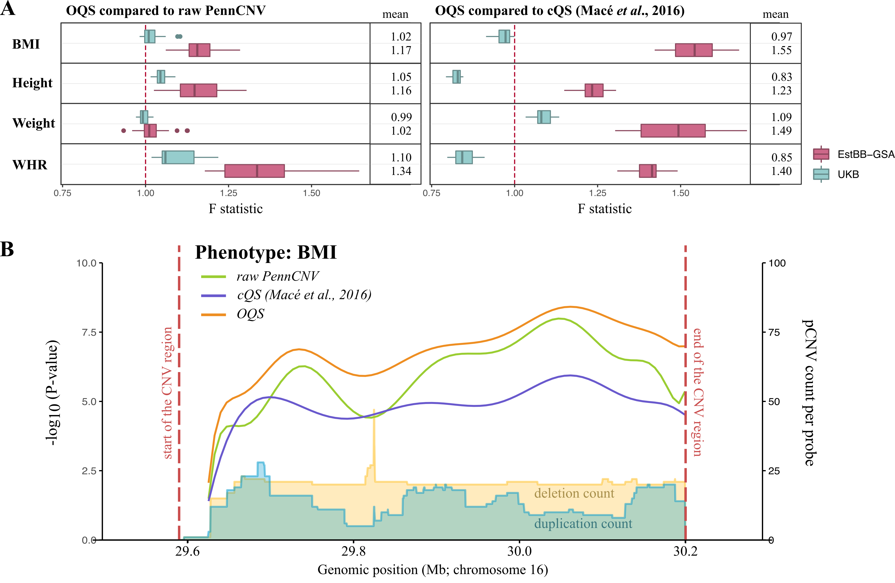

Recently, studying phenotype associations with copy number variations (CNV) have become more common but the CNV detection step remains challenging and prone to false positive calls. 
We have developed (and to provided the user with means to develop) an **omics-informed CNV quality score (OQS)** prediction model based on several omics layers from multiple orthogonal sources. Once developed, OQS model can be used to predict CNV quality even in datasets that lack additional omics layers altogether. Its aim is to down-weight CNV calls based on their likelihood of being false positive and, thus, to improve statistical power for follow-up association analyses. 

Our study focuses on CNV from array data using the popular [PennCNV](http://penncnv.openbioinformatics.org/en/latest/) detection software. We have enclosed our ready-to-use OQS model and the code necessary for the user to directly apply it to their PennCNV data. However, **our quality estimation concepts (and scripts!) are not limited by the choice of detection algorithm**. Even if PennCNV is used, for datasets with at least one additional omics layer available, we strongly encourage the users to build their own custom model tailored for their specific dataset. 

---

# Get started

* Familiarise yourself with our workflow by reading the [**overview**](#workflow-overview) or our [**preprint**](https://doi.org/10.1101/2022.02.07.479374). 
* [**Download**](#workflow-setup) the workflow scripts and necessary R packages.
* [**Estimate**](#general-usage) CNV quality based on 
	* [whole genome sequencing data](#whole-genome-sequencing-metric),
	* [gene expression data](#gene-expression-metric),
	* [methylation intensity data](#methylation-metric) 
	
	*or* [**use**](#applying-penncnv-model-to-your-cnv-data) our prebuilt CNV quality model for PennCNV.
* [**Contact**](#contact-and-citation) us with additional questions or comments.

---

# Workflow overview

**Our workflow can be summarised by the following steps:**

1. **CNV detection** - This step is specific to the choice of your detection method. We used the Hidden Markov Model (HMM)-based [PennCNV](http://penncnv.openbioinformatics.org/en/latest/) software.

2. **CNV quality evaluation based on multiple omics data layers** - Using samples for which additional omics data is available, we calculate an omics-informed quality metric for each CNV. The final metric is combined from up to three individual metrics (with values ranging between 0 and 1) from different omics layers:

	* **whole genome sequencing (WGS) metric** -- WGS metric can be used to assess the quality of CNVs called from genotyping array intensities if (a subset of) samples also have WGS data available. The metric is calculated as the fraction of CNV region (in basepairs) that can be validated with CNVs called from WGS reads;
	* **gene expression (GE) metric** -- GE metric is based on the assumption that true CNVs alter (deletions decrease and duplications increase) the expression level of genes they overlap, while false calls have no effect on gene expression. The metric captures how extreme a gene expression level of a potential CNV carrier is compared to that of the bulk of the samples assumed to be copy neutral;
	* **methylation intensity (MET) metric** -- MET metric is calculated analogously to GE metric and is based on the assumption that true CNVs alter the overall methylation intensity (sum of methylated and unmethylated intensities) of CpG sites they overlap, while false calls do not.

	If more than one omics layer is used, the final quality metric per CNV is taken to be equal to the 'most extreme' omics-based metric of that CNV (i.e., metric that maximises the `abs(0.5 - metric_value)`).
	
	In case omics data is available for the full set of analysis samples, the combined metrics can be directly applied to the association study. Otherwise, if only a subset of samples are used in omics-based metric calculations, the results should be carried over to the next modelling step. 
	
3. **CNV quality modelling** - This step requires the combined metrics and a set of CNV/sample specific parameters (e.g., CNV length, number of CNVs per sample, etc) output by the CNV detection software, as input. It applies the stepwise model selection approach and chooses the subset of given parameters that best predict the combined CNV quality metric. As a results it builds an omics-informed CNV quality score (OQS) model that can be applied to any set of CNVs and that no longer requires the availability of omics data.

4. **CNV quality prediction using OQS model** - As a final step, OQS model will be used to predict the CNV quality for all analysis samples. The output is a score ranging from 0 to 1, which can be applied to association studies similarly to single nucleotide variant dosage values.

---

### How well do the omics-informed quality estimations work?

First, we saw high concordance between our three omics-based metrics. Both GE and MET metrics had high Pearson correlations (R>0.7) when compared to WGS metric. This indicates that either gene expression or methylation intensity data is suitable for CNV quality evaluations if WGS data is not available. All three metrics showed bimodal distribution with modes near 0 and 1 in multiple independent datasets included in our study. Indeed, in all of them >85% of CNVs were evaluated with metric values <0.1 or >0.9. This means that the metrics clearly differentiate between true and false calls for the majority of CNVs.

Secondly, we evaluated the OQS prediction model and demonstrated the improvements achieved using two different approaches: 

* in close family members from three independent datasets, the ‘familial’ CNVs shared between relatives (likely true positives) scored significantly higher with OQS compared to CNVs that were not shared between relatives (mix of true and false positives);
* considering 21 previously published CNV-trait associations ([Macé *et al.*, 2017](https://doi.org/10.1038/s41467-017-00556-x)) and 89,516 Estonian Biobank samples, we showed that the relative increase in variance explained was up to 34% and 55% when comparing OQS to raw PennCNV output and a previously published consensus-based CNV quality score (cQS) ([Macé *et al.*, 2016](https://doi.org/10.1093/bioinformatics/btw477)), respectively. 

&nbsp;

*Figure. Comparison of 16p11.2 BP4-BP5 CNV region association to BMI using raw PennCNV output, consensus-based CNV quality score and omics-informed CNV quality score.*

---

# Workflow setup

The analysis is based on a set of R scripts. R can be downloaded [here](https://www.r-project.org).

All the necessary scripts can be downloaded from GitHub:

~~~sh
git clone https://github.com/maarjl/CNV_OQS.git
~~~

The scripts are run from the command line. The following list of R packages is required for estimating and modelling CNV quality:

~~~r
# In R:
install.packages("data.table")
install.packages("dplyr")
install.packages("tibble")
install.packages("parallel")
install.packages("optparse")

# WGS metric calculation
install.packages("stringr") 

# Methylation data extraction
install.packages("minfi") 
install.packages("IlluminaHumanMethylation450kmanifest") 

# Gene expression metric calculations
install.packages("snpStats") # for eQTL correction
~~~

Additionally, these packages are required to run all the code in this repository (including validation analyses presented in our paper):

~~~r
# In R:
install.packages("bigsnpr")
~~~

---

# General usage

## Formatting pCNV table input

The main input for most of our scripts is a simple tab-delimited pCNV table. To facilitate modelling steps of the workflow, it is necessary that the table already contains all parameters (output by CNV detection algorithm) that will be used as CNV quality predictors.

The table should contain the following columns: `Sample_Name`, `Chromosome`, `Start_Position_bp`, `End_Position_bp` and `Copy_Number`. These columns should be followed by user-specified predictor columns (e.g., CNV length, number of CNVs per sample, etc).

The example pCNV table:

~~~
Sample_Name	Chromosome	Start_Position_bp	End_Position_bp	Copy_Number	Length_bp	...
sample001	3	5601191	5605087	1	3897
sample001	16	77694411	77843210	3	148800
sample002	2	242917734	243034519	1	116786
...
~~~

Instructions for PennCNV output preprocessing can be found [**here**](#applying-penncnv-model-to-your-cnv-data).

---

## Calculations of quality metrics based on omics layers

### Whole genome sequencing metric

Whole genome sequencing (WGS) metric is calculated as the proportion of an array-based CNV that overlaps with a WGS CNV. This step requires a pCNV table and WGS CNVs containing overlapping set of individuals as input.

##### WGS input conversion

In our study we used WGS CNVs detected with [Genome STRiP pipeline](https://software.broadinstitute.org/software/genomestrip/), which outputs the CNVs in VCF format as described [here](https://www.internationalgenome.org/wiki/Analysis/Variant%20Call%20Format/VCF%20(Variant%20Call%20Format)%20version%204.0/encoding-structural-variants/). Our pipeline requires the presence of CHROM and POS (CNV start position) columns, END tag (CNV end position) in INFO column, CN (copy number) and CNQ/FT (CN quality/filter) tags in FORMAT column/genotype fields. 

First, we only keep the necessary data and convert the VCF file to tab-separated table using [bcftools](https://www.htslib.org/download/):

~~~sh
bcftools query \
	-i 'FILTER="PASS"' \
	-f '%CHROM\t%POS\t%END[\t%SAMPLE:CN=%CN:CNQ=%CNQ:FT=%FT]\n' \
	example/example_wgs_cnv.vcf.gz > example/example_wgs_cnv.tsv
~~~

Secondly, we perform the final conversion and filtering using a custom R script. For filtering based on FT tag (PASS/LQ) we run:

~~~sh
Rscript code/Rscript_wgscnv_preparations.R \
	-i example/example_wgs_cnv.tsv \
	--missing 0.1 \
	-o example/example_wgs_cnv_formatted.tsv
~~~

Otherwise, it is also possible to filter based on a threshold CNQ value:

~~~sh
Rscript code/Rscript_wgscnv_preparations.R \
	-i example/example_wgs_cnv.tsv \
	--cnq 10 \
	--missing 0.1 \
	-o example/example_wgs_cnv_formatted.tsv
~~~

In both cases, sites with high missingness (after quality filtering) are excluded.

##### WGS metric calculation:

~~~sh
Rscript code/Rscript_wgs_metric.R \
	--pcnv example/example_pcnv.tsv \
	--wgscnv example/example_wgs_cnv_formatted.tsv \
	--cores 40 \
	-o example/wgs_metrics.tsv
~~~

---

### Gene expression metric

Gene expression (GE) metric is calculated as a measure of gene expression deviation of a potential CNV carrier compared to general copy-neutral population. The required input includes the pCNV table and gene expression matrix. The quality control and normalisation of gene expression values is discussed in the Supplemental Notes of our [paper](https://doi.org/10.1101/2022.02.07.479374) and should be done with external software or scripts. In short, we

1. removed genes with low or no expression in the majority of individuals by requiring for each gene to have ≥ 5 individuals with a count per million (cpm) value greater than 0.5; 
2. normalised remaining genes by weighted trimmed mean of M-values; 
3. calculated the log(cpm) values of each gene, and Z-transformed these values.

As a results, we obtained an expression matrix with genes in rows and samples in columns:

~~~
			sample001	sample002	...
ENSG00000197465	1.02	-0.09	...
ENSG00000204520	0.42	-0.89	...
...
~~~

We have saved it as an R object with .RDS file extension (`example/example_gene_expression.RDS`).

Additionally, a table with gene locations is required with columns `ID`, `Name`, `Chromosome`, `Start` and `End`. Values in column `ID` should match the rownames of expression matrix.

~~~
ID	Name	Chromosome	Start	End
ENSG00000197465	GYPE	4	144792020	144826716
ENSG00000204520	MICA	6	31371356	31383092
...
~~~

##### Correction for eQTLs

Our method presents an option to correct gene expression values to its top SNP eQTL genotypes prior GE metric calculations. For this, we only use SNP eQTLs that are not correlated to CNVs. Our study suggests that such corrections improve the CNV quality estimations. 

Conditional eQTL analysis should be done with external software such as [qtltools](https://qtltools.github.io/qtltools/) and the output should be converted to a table with mandatory columns `Name` and `SNP`:

~~~
ID	SNP
ENSG00000197465	rs0001
ENSG00000197465	rs0002
ENSG00000204520	rs0003
...
~~~ 

We have included an R script to extract eQTLs that are not correlated to CNVs that overlap the corresponsing gene. Currently, our script only supports Plink v1 BED/BIM/FAM files for eQTL genotypes `--bfile`.

~~~
Rscript code/Rscript_get_independent_eqtl.R \
	--pcnv example/example_pcnv.tsv \
	--eqtl example/eqtl_table.tsv \
	--bfile example/eqtl_genotypes \
	--gene_loc example/gene_locations.tsv \
	-o example/independent_eqtl_list.RDS
~~~ 

##### Covariates table

Besides eQTLs, it is possible to add any number of covariates to GE metric calculations. The covariates should be in a separate tab-delimited table with first column as sample names (see example table below). The table should contain a header. 

~~~
Sample_Name	Cov1	Cov2	...
sample001	1	0.43
sample002	1	1.20
sample003	2	0.98
...	
~~~ 

All gene expression values will be corrected for covariates prior further calculations. In our study we corrected the gene expression for age, sex, blood component values, batch and four principal components (PCs) calculated based on SNP genotypes. Optionally, a number of PCs calculated from the gene expression matrix can be used as covariates. However, these can be specified in the metric calculation step and should not be included in the covariates table.

##### GE metric calculation

Additionally, GE metric calculation step takes the following optional parameters:

* `--gene_overlap` specifies the required overlap between gene and CNV (in bp), divided by the length of the gene;
* `--dd_genes` is a list of dosage-dependent genes (i.e., genes correlated to CNVs) found in an independent study ([Talevich and Hunter Shain, 2018](https://www.biorxiv.org/content/10.1101/408534v1));
* `--dd_cutoff` is a correlation cutoff based on which the dosage-dependence is established;
* `--npcs` is a number of expression PCs used as covariates.

~~~
Rscript code/Rscript_ge_metric.R \
	--pcnv example/example_pcnv.tsv \
	--ge example/example_gene_expression.RDS \
	--covariates example/example_covariates.tsv \
	--eqtl example/independent_eqtl_list.RDS \
	--bfile example/eqtl_genotypes \
	--gene_loc example/gene_location_table.tsv \
	--gene_overlap 0.8 \
	--dd_genes tcga-skcm.cnv-expr-corr.tsv \
	--dd_cutoff 0.1 \
	--cores 40 \
	--npcs 10 \
	-o example/ge_metrics.tsv
~~~ 

---

### Methylation metric

Methylation (MET) metric is calculated analogously to GE metric and is a measure of overall methylation intensity deviation of a potential CNV carrier compared to general copy-neutral population. The required input includes the pCNV table and methylation IDAT files from Illumina Human Methylation 450k array. Additionally, a table with CpG site locations is required, containing columns `ID`, `Chromosome` and `Position`.

##### Methylation data preparations

We require a two-column table (`--samples samples_idat.tbl`) of samples containing sample names and path to its IDAT files:

~~~
Sample_Name	Path  
sample001	/path/to/sample001
sample002	/path/to/sample002
...
~~~

For each sample, a pair of IDAT files should be present `${Path}_Grn.idat` and `${Path}_Red.idat`. Methylation matrices are generated using an R script:

~~~sh
Rscript code/Rscript_prepare_methylation_matrices.R \
	--samples samples_idat.tbl \
	--output example/example_meth_formatted.RDS
# input of this script (or idat files) is not included in the example data
~~~

Some notes about the output matrices:

* Only type II CpG sites will be used in the analysis; 
* rownames of the output matrices should match the `ID` column in CpG site locations table.

##### Covariates table

It is possible to add any number of covariates to MET metric calculations. The covariates should be in a separate tab-delimited table with first column as sample names (see example table below). The table should contain a header. 
All methylation intensity values will be corrected for covariates prior further calculations. Since in our study we only use overall methylation intensity values (sum of methylated and un-methylated intensities) per CpG site, we primarily suggest to include technical aspects as covariates, i.e., study name (if several methylation studies are combined). 

Example covariates table:

~~~
Sample_Name	Study  
sample001	STD1
sample002	STD1
...
sample050	STD2
...
~~~

Optionally, a number of PCs calculated from the overall methylation intensity matrix will be used as covariates. However, these can be specified in the metric calculation step and should not be included in the covariates table.

##### MET metric calculation:

~~~sh
Rscript code/Rscript_met_metric.R \
	--pcnv example/example_pcnv.tsv \
	--meth example/example_methylation_formatted.RDS \
	--covariates example/example_covariates.tsv \
	--cpg example/cpg_locations.tsv \
	--cores 40 \
	--npcs 10 \
	-o example/met_metrics.tsv
~~~

### Combined omics-based metric

The next step is to combine all calculated metrics into one table and calculate the combined metric. The parameters `--wgs`, `--ge` and `--meth` specify the metrics you have calculated. The metrics that you did not use, should be omitted. This step should be run even if just one type of metric was used.

Additionally, `--num_combine` parameter specifies the number of metrics (up to three) that a CNV should have for it to be included in the combined metric calculation. For example, `--num_combine 2` means that a CNV should have at least two metrics out of three available.

~~~sh
Rscript code/Rscript_combined_metric.R \
	--wgs example/wgs_metrics.tsv \
	--ge example/ge_metrics.tsv \
	--meth example/met_metrics.tsv \
	--num_combine 2 \
	-o example/full_metrics.tsv
~~~

---

## Modelling CNV quality

CNV quality model-building step requires the previously compiled table of combined omics-based metrics. Note that the table should already contain all the columns that you wish to use as predictors. These column names should be listed either as `--sample_column` (if they are sample-specific, e.g. number of CNV calls per sample) or `--cnv_column` (if they are CNV-specific, e.g. CNV length in basepairs). When evaluating genotyping array-based CNVs, Some variables such as number of CNVs per sample are dependent on the array density. Therefore, we suggest correcting these values for array density prior model building step (see also Supplemental information of our [preprint](https://doi.org/10.1101/2022.02.07.479374)).

Additionally, the name of the metric that you wish to model should be provided as `--metric_column`.

~~~sh
Rscript code/Rscript_model_cnv_quality.R \
	-i example/full_metrics.tsv \
	--metric_column Combined_Metric \
	--sample_column LRR_mean,LRR_SD,BAF_SD \
	--cnv_column Length_bp,Max_Log_BF \
	--k 3 \
	--cores 20 \
	-o example/oqs_model
# for real datasets we advise using --k 10
~~~

---

## Scoring CNVs

To score CNVs with your custom-built omics-informed quality model, a new (or overlapping) set of CNVs and two quality models (one for deletions, one for duplications) should be provided to the script.

~~~sh
Rscript code/Rscript_predict_cnv_quality.R \
	--pcnv example/example_pcnv_new.tsv \
	--del_model example/oqs_model_deletions.tsv \
	--dup_model example/oqs_model_duplications.tsv \
	-o example/example_pcnv_new_oqs_predictions.tsv
~~~

## Applying PennCNV model to your CNV data

#### Preparing PennCNV output

User guide to PennCNV is brought [elsewhere](http://penncnv.openbioinformatics.org/en/latest/) and will not be described here. There are two required PennCNV output files necessary to create the CNV table for quality estimations:

* the cleaned CNV file with nearby CNV regions merged (output of PennCNV `clean_cnv.pl` script);
* and sample quality summary table which can be generated using PennCNV `filter_cnv.pl` script (`-qcsumout` flag). 

If corresponding parameters provided, this script will also calculate additional array size-dependent variables and filter samples based on maximum number of CNV calls and length. Example command line:

~~~sh
Rscript code/Rscript_convert_raw_penncnv_calls.R \
	--cnv penncnv_cleaned.cnv \
	--samples penncnv_qcsummary.qcsum \
	--arraysize 700000 \
	--max_numcnv 200 \
	--max_len 10000000 \
	--cores 20 \
	-o pcnv_table.tsv
~~~

#### Estimating PennCNV calls quality

Applying our ready-to-use PennCNV quality models to your data is analogous to scoring CNVs with a custom-made model:

~~~sh
Rscript code/Rscript_predict_cnv_quality.R \
	--pcnv example/example_pcnv_new.tsv \
	--del_model models/PennCNV_model_deletions.tsv \
	--dup_model models/PennCNV_model_duplications.tsv \
	-o example/penncnv_oqs_predictions.tsv
~~~

The input CNV table should contain the following columns (all included by `code/Rscript_convert_raw_penncnv_calls.R` script):

~~~
Max_Log_BF - PennCNV-specific CNV confidence measure
Length_bp - CNV length in basepairs
LRR_mean - Mean of log R ratio
LRR_SD - Standard deviation of log R ratio
BAF_mean - Mean of B allele frequency
BAF_drift - Drift of B allele frequency
NumCNV_bin - array size-dependent binary value that equals 1 when 
				(number of CNVs per sample / array density) >3.8e-5 
				and 0 otherwise
~~~

---

# Contact and citation

Correspondence should be addressed to:

Maarja Lepamets  
PhD student, Institute of Genomics, University of Tartu  
maarja.lepamets@ut.ee

Zoltán Kutalik  
Associate Professor, Department of Computational Biology, University of Lausanne  
zoltan.kutalik@unil.ch

---

If you apply our omics-informed CNV quality estimation concept or use the OQS model for PennCNV in your work, please cite the following preprint:  

*Lepamets M., Auwerx C., Nõukas M., Claringbould A., Porcu E., Kals M., Jürgenson T., Estonian Biobank Research Team, Morris A.P., Võsa U., Bochud M., Stringhini S., Wijmenga C., Franke L., Peterson H., Vilo J., Lepik K., Mägi R.\*, Kutalik Z.\** ***Omics-informed CNV calls reduce false positive rate and improve power for CNV-trait associations.*** *(2022) bioRxiv.* [https://doi.org/10.1101/2022.02.07.479374](https://doi.org/10.1101/2022.02.07.479374)

 

