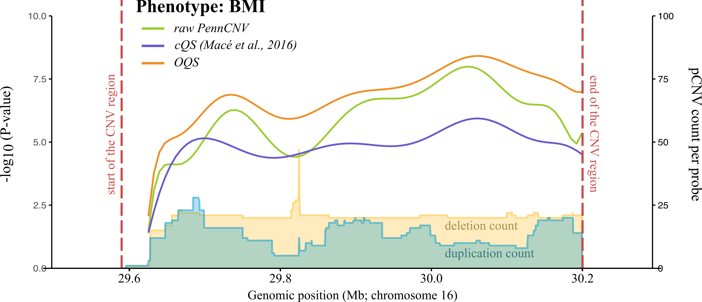

# Omics-informed CNV Quality Estimation

Copy number variation (CNV) association analyses have become more common but CNV detection tools are still prone to false positives. Our aim was to develop (and to provide the reader with means to develop) a CNV quality score that down-weights CNV calls based on their likelihood of being false positive. We have built a workflow (**Figure 1A**) that (a) estimates CNV quality based on additional omics layers and (b) builds an omics-informed quality score (OQS) prediction model based on these estimations for sample sets without any additional omics layers. We consider up to three different omics layers:

* whole-genome sequencing (WGS) -- true CNVs called from genotyping array intensities can be validated CNVs called from WGS reads (**Figure 1B**);
* gene expression (GE) -- true CNVs alter (deletions decrease and duplications increase) the expression of genes they overlap, while false calls have no effect on gene expression (**Figure 1C**);
* methylation intensity (MET) -- true CNVs alter the overall methylation intensity (sum of methylated and unmethylated intensities) of CpG sites they overlap, analogously to gene expression (**Figure 1C**). 

***Figure 1.*** *jou*

Paper reference link

## Installation

The analysis is based on a set of R scripts. All scripts are run from the command line.
R can be downloaded [here](https://www.r-project.org).

The following list of R packages is required for estimating and modelling CNV quality:

~~~r
install.packages("data.table")
~~~

Additionally, these packages are required to run all the code in this repository (including validation analyses presented in our paper):

~~~r
install.packages("something")
~~~

## General usage

### Input

### Calculations of quality metrics based on omics layers

#### Based on WGS

~~~sh
mkdir jou
~~~

#### Based on methylation or gene expression

### Modelling CNV quality

### Scoring CNVs

### PennCNV output conversion

### Applying PennCNV model to your CNV data

## Analyses performed

### Familial CNV analysis

Figure relatives of Omni

### Association analysis per CNV region

Figure of 16p region

 

